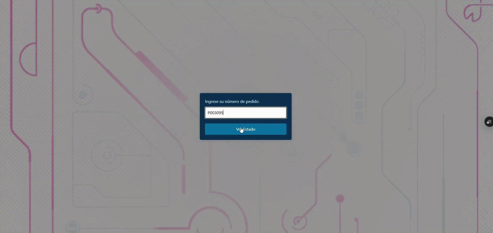
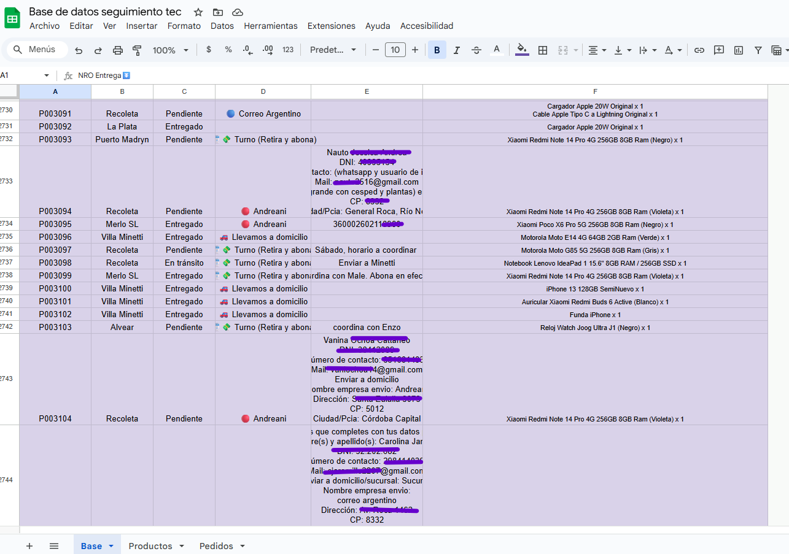

# 📦 Seguimiento de Envíos – Tec Store Argentina

Aplicación web desarrollada para que los clientes de Tec Store puedan consultar el estado de su pedido ingresando su número de orden. Se conecta a una hoja de Google Sheets y muestra una barra de progreso animada junto con detalles del envío.

> ✅ En uso real desde 2024  
> 🌐 Versión pública: [tracking-tecstore.vercel.app](https://tracking-tecstore.vercel.app/)

---

## 🎯 ¿Para qué fue creada?

Esta herramienta fue desarrollada para **automatizar la consulta de envíos** y evitar que los clientes tengan que escribir por WhatsApp o Instagram para preguntar por su pedido. Además:

- Brinda seguimiento visual y moderno
- Informa ubicación, estado y productos
- Enlaza con el tracking oficial si aplica
- Se actualiza en tiempo real desde Google Sheets

---

## 🧠 ¿Cómo funciona?

1. El cliente ingresa su **número de pedido** (formato `PXXXXXX`)
2. El sistema busca ese pedido en Google Sheets
3. Se muestran:
   - Progreso animado por etapas (pedido, en viaje, pendiente, entregado)
   - Datos logísticos: empresa, código de seguimiento, link externo si aplica
   - Productos del pedido y ubicación actual
4. Si el número no existe, se muestra un mensaje de error

Todo funciona sin backend propio, accediendo directamente a Google Sheets con API pública (solo lectura).

---

## 🔄 Etapas del pedido

Se muestran mediante una barra animada:

- Pedido Realizado 🛒
- En Viaje ✈️
- Pendiente 📦
- Entregado o Despachado 🏠/🚚

Además, si el pedido es enviado por **Andreani, Correo Argentino o Via Cargo**, se muestra el botón de seguimiento externo con su respectivo link.

---

## 🔍 Detalles que también se muestran

- Ubicación actual del paquete (ej: “Sucursal de La Plata”)
- Nombre de la empresa de logística
- Código de seguimiento
- Productos comprados
- Tiempo estimado de entrega según el estado

---

## 🖼️ Vista del sistema en funcionamiento

### 🎥 Flujo completo de uso

  

<i>El cliente consulta su pedido y visualiza el estado de forma animada y clara.</i>

---

### 🧾 Formulario de búsqueda de pedido

  

<i>El usuario debe ingresar su número de pedido en formato <code>PXXXXXX</code> para consultar el estado.</i>

---

## ⚙️ Tecnologías utilizadas

- `React` – SPA moderna
- `Vite` – Build rápido
- `Tailwind CSS` – Estilos minimalistas
- `Google Sheets API` – Fuente de datos (lectura)
- `Framer Motion` – Animaciones suaves
- `localStorage` – Para guardar el último pedido consultado
- `Vercel` – Hosting del sitio

---

## 📝 Notas adicionales

- No se requiere login ni backend
- El formulario valida y guarda el último pedido consultado para comodidad del usuario
- El diseño es responsive y adaptado a mobile

---

> 💬 *“Creamos una experiencia simple, visual y automática para que cada cliente pueda seguir su pedido sin depender de nadie.”*
